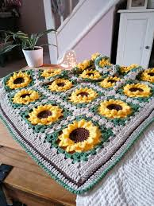
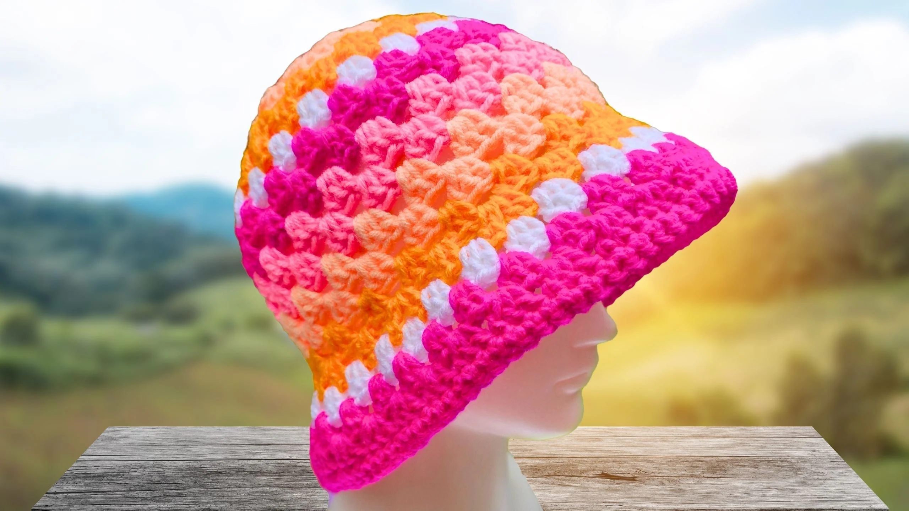
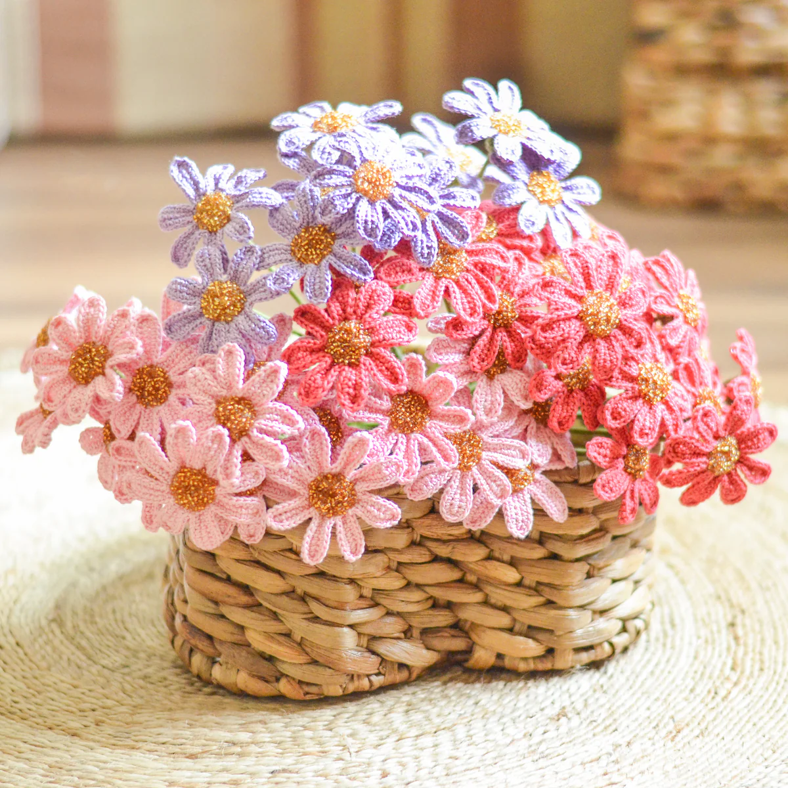
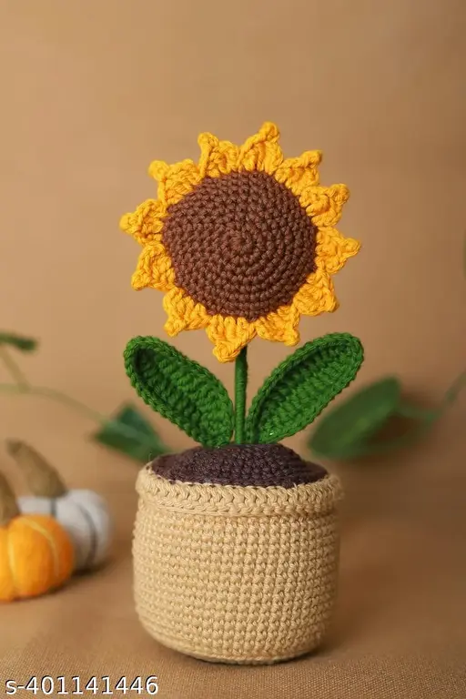
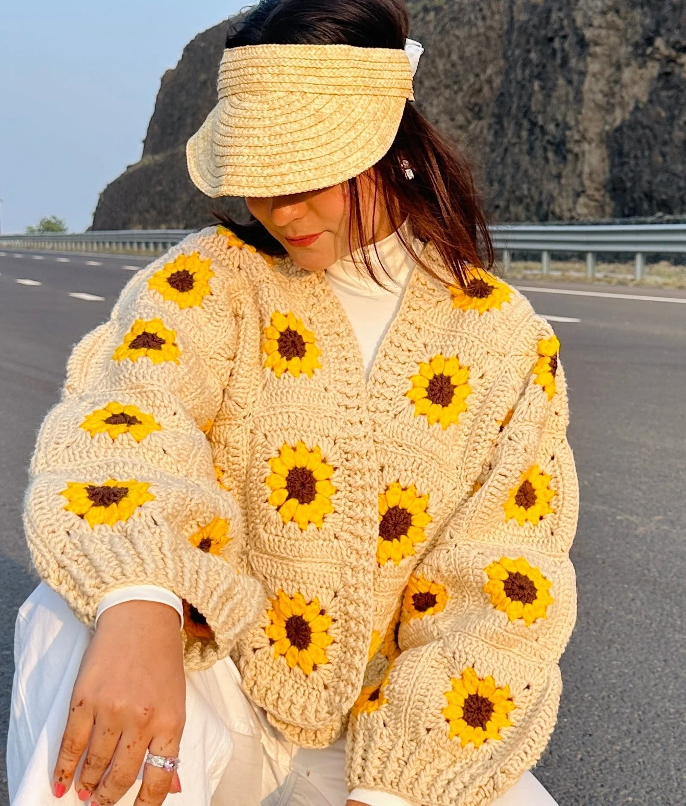
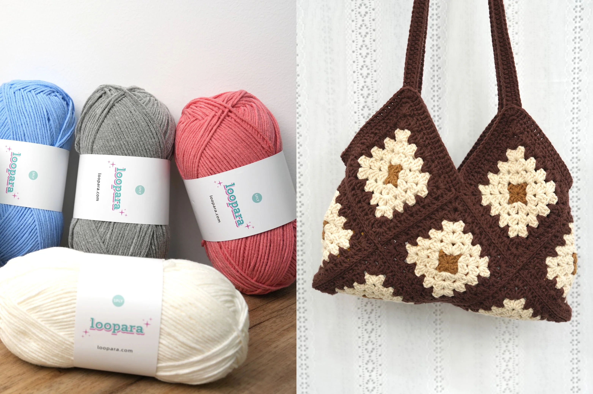

<!DOCTYPE html>
<html lang="en">
<head>
  <meta charset="UTF-8">
  <meta name="viewport" content="width=device-width, initial-scale=1.0">
  <title>Crochet Cozy — Handmade Creations</title>
  <link rel="stylesheet" href="./style.css">
</head>
<body>
  <!-- HEADER -->
  <header style="background-image: url(./2021-07-23_1_480x480.webp);">
    
🧶 CrochetCozy

    <nav>
      <ul>
        <li><a href="#" style="color: rgb(218, 33, 33);">Home</a></li>
        <li><a href="#categories" style="color: rgb(245, 42, 42);">Categories</a></li>
        <li><a href="#products" style="color: rgb(224, 39, 39);">Products</a></li>
        <li><a href="#contact" style="color: rgb(241, 52, 52);">Contact</a></li>
      </ul>
    </nav>
    

      <input type="text" placeholder="Search Crochet Items...">
    

  </header>

  <!-- HERO -->
  <section class="hero" style="background-color: palevioletred; background-image: url(./Best_Yarn_for_Crochet_Bags.webp);">
    

      <h1>Handmade Crochet with Love</h1>
      
Discover cozy blankets, trendy bags, and colorful yarns crafted with care.

      <a href="#products" class="btn">Shop Now</a>
    

  </section>

  <!-- CATEGORIES -->
  <section id="categories" class="categories" style="background-color: palevioletred;">
    <h2>Shop by Category</h2>
    

      

        
        <h3>Bags</h3>
      

      

        
        <h3>Blanket</h3>
      

      

        
        <h3>Hats</h3>
      

      

        
        <h3>Accessories</h3>
      

    

  </section>

  <!-- PRODUCTS -->
  <section id="products" class="products" style="background-color: antiquewhite;">
    <h2>Our Bestsellers</h2>
    

      

        
        <h3>Sunflower </h3>
        
₹799

        <a href="#" class="btn">Add to Cart</a>
      

      

        
        <h3>Trendy Cardigan</h3>
        
₹1199

        <a href="#" class="btn">Add to Cart</a>
      

      

        
        <h3>Yarn Pack and Bag</h3>
        
₹2499

        <a href="#" class="btn">Add to Cart</a>
      

      

        
        <h3>Crochet soft toys makekit</h3>
        
₹599

        <a href="#" class="btn">Add to Cart</a>
      

    

  </section>

  <!-- FOOTER -->
  <footer id="contact">
    
📧 Email: crochetcozy@example.com | 📞 Phone: +91 98788880000

    
&copy; 2025 Crochet Cozy vibes.

  </footer>
</body>
</html>
